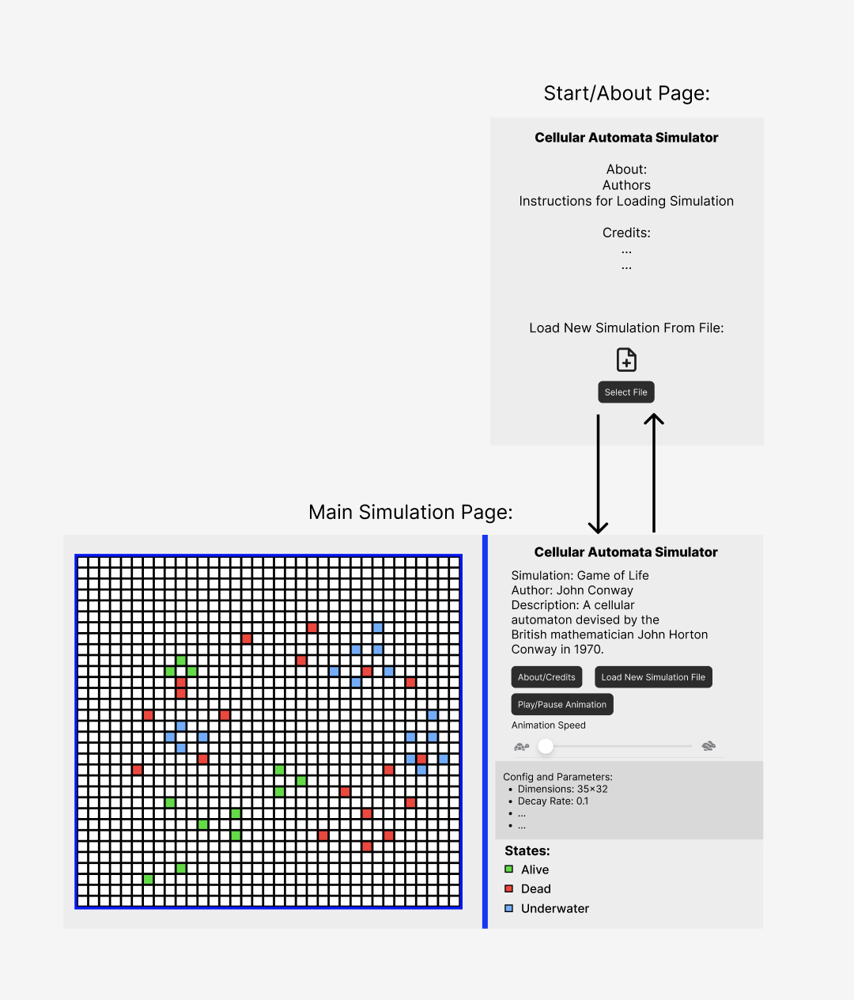

# Cell Society Design Plan
### Team Number: 4
### By: Owen Jennings (otj4), Justin Aronwald (jga18), Troy Ludwig (tdl21)

## Overview
Through this project, our team hopes to create an interactive Cellular Automata simulations. Our program will allow for multiple different simulation types configured by formatted XML files. The program will begin by prompting the user to select a simulation file to load, which runs the simulation on load. The application will show a grid view that animates (steps through) each predetermined time step. 
Our main goals include a functional simulation created by proper encapsulated code and abstraction. We hope to build on the skills developed in class and work on effectively modularizing the code. We want the design to be flexible in the sense that new simulations added are easily loaded and new user features are easily integrable.    

At a high level, we know that we are going to include a hierarchy for the grid. The cell class will be abstracted to handle the various cell cases. We are going to ensure proper separation between the UI elements and the translation of files into the grid-like system. Broadly, each cell is going to have methods for updating its state and relations to its neighbors.

In terms of high level flow, users are going to input an XML file with the grid coordination. Then, each cell's status will be determined by a set of rules predefined for that specific simulation. Then, each cell will be processed and the grid will be updated to accommodate each of the cell changes. Finally, the UI will be updated to display the changes to the user.


## User Interface

We created a user interface design using Figma:



To view our Figma UI design online visit this link: [https://www.figma.com/design/fb8PYecEdF8yTVQFFQ9pHn/Untitled?node-id=0-1&t=o72ftO1mXizAi2pu-1](https://www.figma.com/design/fb8PYecEdF8yTVQFFQ9pHn/Untitled?node-id=0-1&t=o72ftO1mXizAi2pu-1)

Our program will have an alert popup telling the user if there is any issues with the program.
It will display a message like "File Not Found", "Incorrect XML File Format", "Invalid User Input", "Error ...", to alert the user whenever the program runs into an error.

## Configuration File Format
For the XML file, we want tags that will specifically configuration a variety of simulation environments. These tags should include:
* Simulation type: the name of the simulation that represents a set of rules
* Simulation title: a name for the specific starting configuration
* Simulation author: who wrote this starting configuration
* Simulation description: what you expect to see or why you find this configuration interesting
* Grid dimensions: height and width of the grid
* Initial configuration states: what action is every cell taking at the beginning (ie. dead or alive, burning or empty, etc.)
* Specific parameter values: any extra information required by the defined simulation type (ie. burning propability for Fire and nothing for Game of Life.)

Link to example 1: [Example 1](../data/ExampleXMLs/Example1.xml)

Link to example 2: [Example 2](../data/ExampleXMLs/Example2.xml)


## Design Overview
The abstractions we hope to create are the following:
* **Simulation class** - performs actions associated with simulation progress
  * This abstract class will be implemented by each type of simulation created (i.e Game of Life) based on how a simulation should be updated with respect to its given rules
  * **Collaboration:** the simulation class will interact with the Grid class to iterate through the Cell classes and update statuses. It will also likely interact with XML files to load the simulation paramters
* **SimulationRules class** - holds the rules for the current simulation based off simulation type in the XML
  * This abstract class will be implemented by each type of simulation created (i.e Game of Life) containing the rules for that game
  * **Collaboration:** the SimulationRules class will interact with the XMLHandler class to get the current ruleset based on simulation type and work with the Simulation and Grid classes to incorporate the necessary changes
* **Cell class** - each cell represented on the grid
    * Each of the cells are going to maintain their current state
    * This abstract class will be implemented by a cell for each type of simulation (i.e Game of Life) and each simulation has a different set of rules/properties by which the cell operates 
    * **Collaboration:** the cell class will interact with its neighbors (other instances of the Cell class)
* **View class** - represents the GUI for the user
  * Displays the grid and handles the user input
  * This abstract class will be implemented by subclass representing different aspects of the simulation UI (cells, grid, simulation components)
  * **Collaboration:** the view class will interact with the Simulation and Grid class to visualize the current state of the simulation

The other classes include:
* **SimulationData class** - holds data from XML file associated with current simulation
  * **Collaboration:** will interact with the XMLHandler class to get the data it needs to store for the simulation. Will also give necessary information to Simulation class when requested.
* **Grid class** - the 2D grid of cells
  * Manages the data structure that we will use to hold the 2D grid as well as reference  
  * **Collaboration:** the grid class will interact with the Cell class to update states
* **XMLHandler class** - handles the loading and saving of XML files
  * Parse the XML file to load the grid state and rules. Also handles the saving the current status back to an XML file
  * **Collaboration:** Takes and saves data from Simulation and Grid classes


## Design Details
**Simulation and SimulationRules**
* Must interact with XMLHandler to get the ruleset for this specific simulation and pass those rules to the Simulation to enact necessary changes
* Will call getNeighbors() from SimulationRules to get relevant neighbors for the simulation and make next state changes based on the implementation of getNextState() from the Simulation class

**Simulation getNextState(Cell cell) and getNeighbors(Cell cell) implementations:**
  * Game of Life:
    1. Any cell with fewer than 2 neighbors dies due to underpopulation
    2. Any cell with 2 - 3 neighbors moves on to the next generation
    3. Any cell with more than 3 neighbors dies due to overpopulation
    4. Any inactive cell with exactly 3 neighbors becomes active
  * Percolation:
    * Any cell connected to the "top" (or any open water source) will also become full of water
    * Blocked cells cannot be filled with water
  * Spreading of Fire
    * If a tree cell's neighbor is burning, that tree cell has a probability p of catching fire.
    * If a cell is burning, the cell will become empty next turn
    * An empty cell cannot catch fire
  * Schelling's Model of Segregation
    * Each cell has a "alike neighbor threshold"
    * If a cell's percentage of alike neighbors falls below a certain threshold, it will move to another open cell in the grid in an attempt to move closer to people it is more similar to
  * Wa-Tor World
    * For fish:
      1. Every time interval, the fish moves to an unoccupied adjacent space. If there are no unoccupied adjacent spaces, it does not move.
      2. After a certain number of turns, the fish will reproduce by leaving a new fish on its previous space when moving
    * For sharks:
      1. Every time interval, the shark moves to a random adjacent space occupied by a fish. If there are no fish nearby, it simply moves to a random adjacent space. If there is no open adjacent space, it does not move.
      2. Every time interval, the shark is deprived of one unit of energy
      3. Upon reaching 0 energy, the shark dies
      4. If the shark moves to a space occupied by a fish, it eats the fish and gains a certain amount of energy
      5. After a certain number of turns, the shark reproduces the same way a fish does

**Cell**
* Must interact with Simulation and Grid for necessary updates and displaying these updates
**Cell Subclasses**
  * Game of Life:
    * 2 states (dead or alive)
  * Percolation
    * 3 states (blocked, open (empty), open (water))
  * Spreading of Fire
    * 3 states (tree, burning, empty)
  * Schelling's Model of Segregation
    * 2 states (for each racial/preference group)
    * decides to move based on their neighbors race/state
  * Wa-Tor World
    * 3 states (shark, fish, or empty)
    * Need an identifier for when either are ready to reproduce or out of energy

**View**
* Must interact with each class represented by its subclasses (Cell, Grid and Simulation)
**View Subclasses**
  * CellView
  * GridView
  * SimulationView

## Design Considerations
* We considered keeping all simulation function within the Simulation class (data and rule storage, state updates, etc.) instead of splitting the duties between the SimulationRules, SimulationData and Simulation classes.
  * Pros:
    * Organizationally simple
  * Cons:
    * Would lead to a more difficult to read class
    * Leaves too much implementation to a single class
* We considered passing all simulation rules in as arguments to the XML configuration file instead of utilizing abstraction to make specific case subclasses for each simulation type.
  * Pros:
    * Could provide more flexibility and scability to the code
  * Cons:
    * Unnecessary for the number of simulations we're planning to implement (5)
    * Would not show a great understanding of abstraction


## Use Cases

* Apply the rules to a middle cell: set the next state of a cell to dead by counting its number of neighbors using the Game of Life rules for a cell in the middle (i.e., with all its neighbors)

```java
Simulation simulation = GameOfLifeSimulation();
Cell middleCell = new DefaultCell(); // default cell is a cell with 2 states (0 or 1)
List<Cell> neighbors = simulation.getNeighbors(middleCell);
int numAliveNeighbors = 0;
for (Cell neighbor: neighbors) {
  if (neighbor.getState() == Cell.ALIVE) {
    numAliveNeighbors++;
  }
  if (numAliveNeighbors < 2 || numAliveNeighbors > 3) {
    middleCell.setState(Cell.DEAD)
  } 
}
```

* Apply the rules to an edge cell: set the next state of a cell to live by counting its number of neighbors using the Game of Life rules for a cell on the edge (i.e., with some of its neighbors missing)

```java
public class GameOfLifeSimulation {
  public static List<Cell> getNeighbors(Cell cell) { // implementation of abstract class
    List<Cell> neighbors = new ArrayList<Cell>();
    if (cell.getX() > 0) {
      neighbors.add(Grid.getCell(cell.getX() - 1, cell.getY()));
    }
    if (cell.getX() < Grid.getWidth() - 1) {
      neighbors.add(Grid.getCell(cell.getX() + 1, cell.getY()));
    }
    if (cell.getY() > 0) {
      neighbors.add(Grid.getCell(cell.getX(), cell.getY() - 1));
    }
    if (cell.getY() < Grid.getHeight() - 1) {
      neighbors.add(Grid.getCell(cell.getX(), cell.getY() + 1));
    }
    if (cell.getX() > 0 && cell.getY() > 0) {
      neighbors.add(Grid.getCell(cell.getX() - 1, cell.getY() - 1));
    }
    if (cell.getX() < Grid.getWidth() - 1 && cell.getY() > 0) {
      neighbors.add(Grid.getCell(cell.getX() + 1, cell.getY() - 1));
    }
    if (cell.getX() > 0 && cell.getY() < Grid.getHeight() - 1) {
      neighbors.add(Grid.getCell(cell.getX() - 1, cell.getY() + 1));
    }
    if (cell.getX() < Grid.getWidth() - 1 && cell.getY() < Grid.getHeight() - 1) {
      neighbors.add(Grid.getCell(cell.getX() + 1, cell.getY() + 1));
    }
    return neighbors;
  }
}

Simulation simulation = GameOfLifeSimulation();
Cell middleCell = new DefaultCell(); // default cell is a cell with 2 states (0 or 1)
List<Cell> neighbors = simulation.getNeighbors(middleCell);
int numAliveNeighbors = 0;
for (Cell neighbor: neighbors) {
    if (neighbor.getState() == Cell.ALIVE) {
numAliveNeighbors++;
    }
    if (numAliveNeighbors < 2 || numAliveNeighbors > 3) {
    middleCell.setState(Cell.DEAD)
  }
}
```

* Move to the next generation: update all cells in a simulation from their current state to their next state and display the result graphically

```java
GameOfLifeSimulation simulation = new GameOfLifeSimulation();
SimulationView mainView = new SimulationView();
...
simulation.getNextState();
mainView.update();
```

* Switch simulations: load a new simulation from a data file, replacing the current running simulation with the newly loaded one

```java
currentSimulation = XMLFileHandler.parseXMLFile("simulation.xml");
```

* Set a simulation parameter: set the value of a parameter, probCatch, for a simulation, Fire, based on the value given in a data file

```java
public class SimulationRules {
  private Map<String, Double> parameters;
  public SimulationRules(..., Map<String, Double> parameters) {
    this.parameters = parameters;
  }
  public getParameter(String para) {
    return parameters.get(para);
  }
}
```

Additional Use Cases:
1. Change how a simulation handles getting the next state for an individual cell
```java
public class CustomSimulationRules extends SimulationRules {
  public List<Cell> getNeighbors(Map<Point, Cell> points, Cell cell) {
    // find neighbors from a map of cells based on the current cell's location
    // default implementation from SimulationRules class will be to return the list of 8 normal neighbors, so this does not need to override for all simulation types
  }
  public int getNextState(Cell cell) {
    List<Cell> neighbors = getNeighbors(cell);
    int nextState = 0;
    int currentState = cell.getState();
    for (Cell neighbor: neighbors) {
      // do some logic to get next state based on custom simulation...
    }
    return nextState;
  }
}
```

2. Get the cell at the location (x,y) or return null if a cell does not exist at that location

```java
import java.awt.geom.Point2D;
import java.util.HashMap;

public class Grid {

  private Map<Point2D, Cell> myCells = new HashMap<>();
  
  private getCell(Point2D point) {
    Cell cell = myCells.get(point);
    return cell;
  }
}
```

## Team Responsibilities
 * Before Friday, we hope to get all the model finished and create necessary configuration files

 * Troy Ludwig - XML Handling & Grid View

 * Owen Jennings - Cell and Grid Implementation and Simulation/Main View

 * Justin Aronwald - Simulation (Simulation Rules and Data) and Cell View
