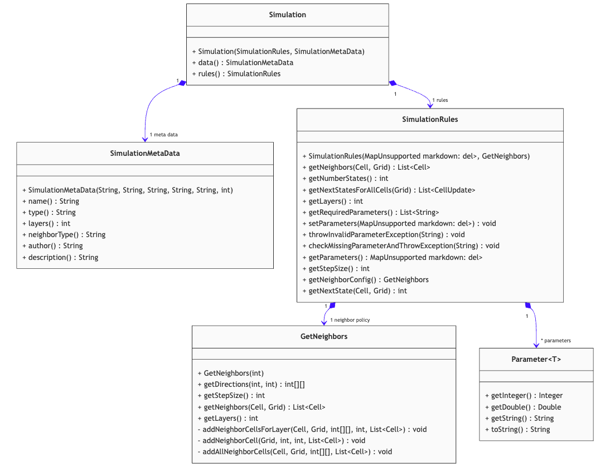
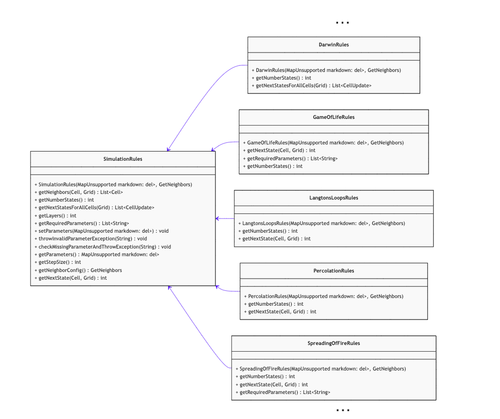
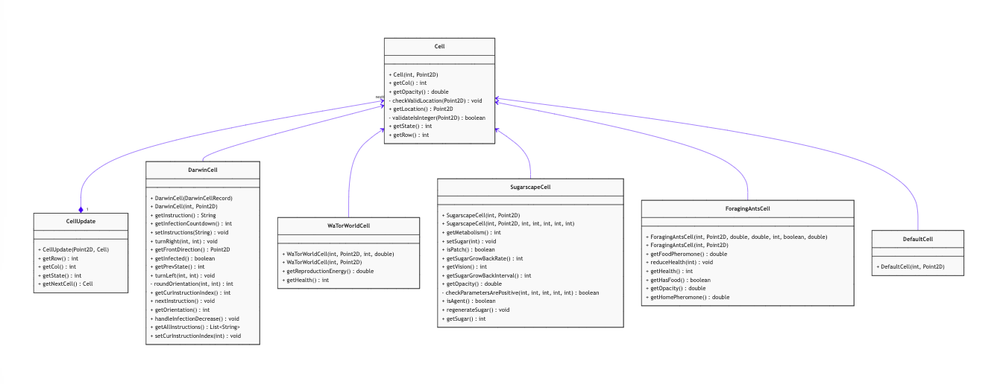
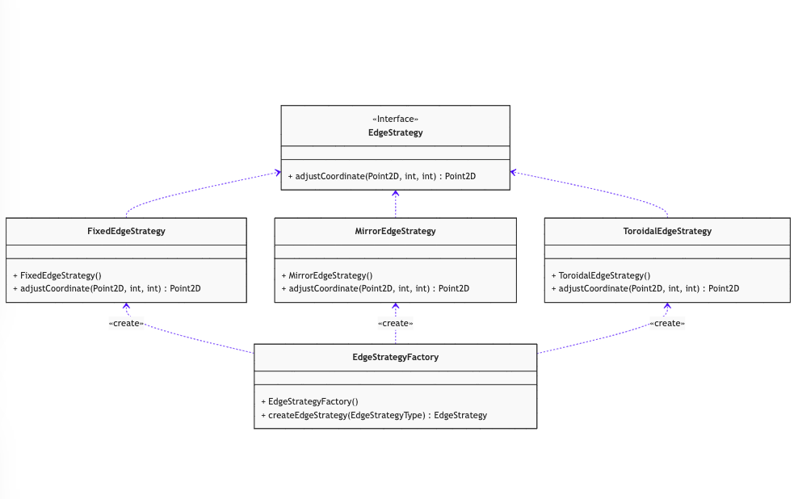
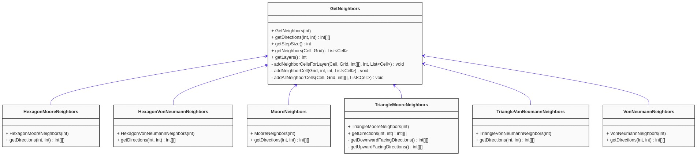
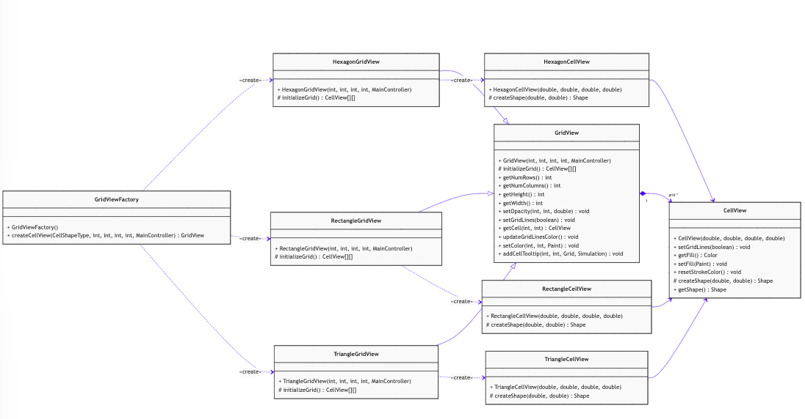

# Cell Society - Class Presentation & Demo
## Group 4 - Owen Jennings, Troy Ludwig, Justin Aronwald

## Project Design:

#### Model Overview:

#### View Overview:

*Note: These UML Diagrams do not include all methods and classes to remain concise for the
presentation.*